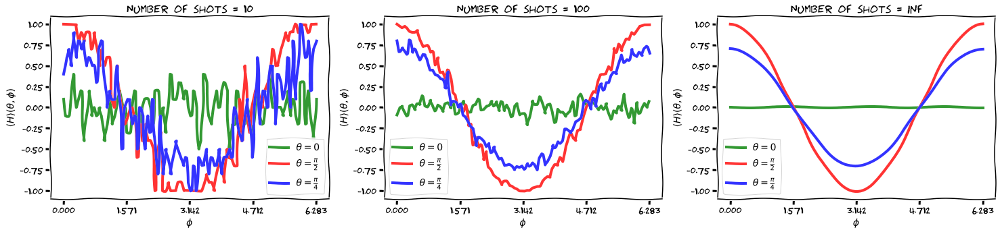
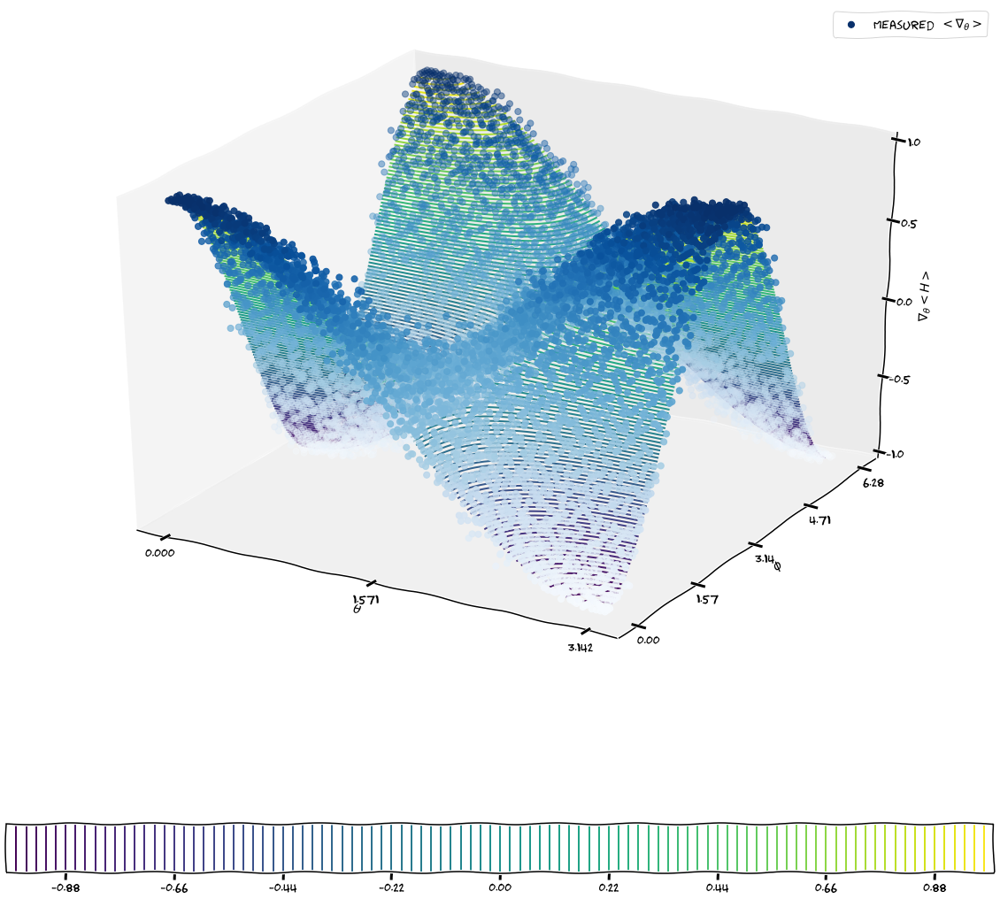
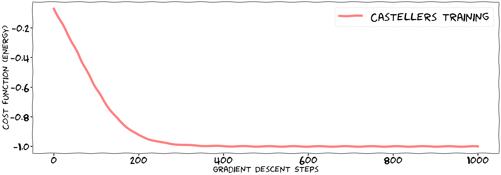
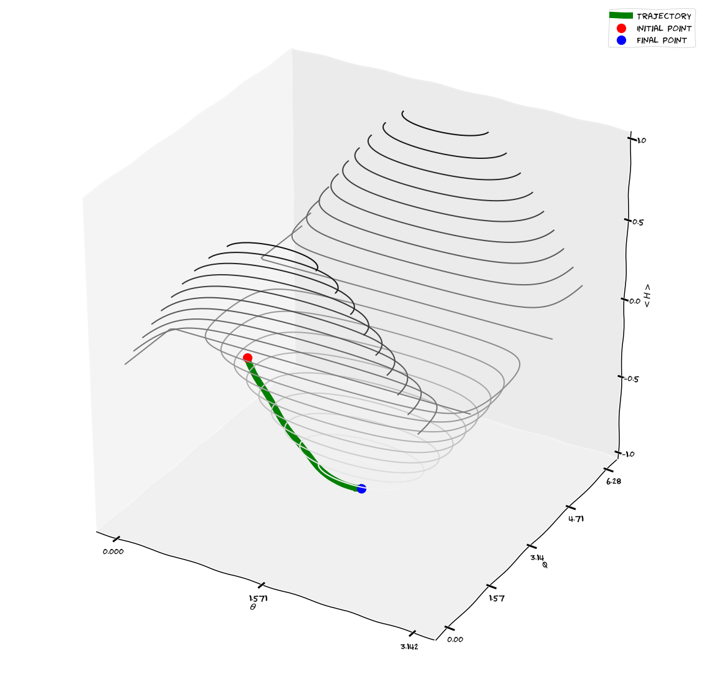

# castellers

(Part of the) code for Quantum Computing tutorial given at "Física Quàntica II", Autonomous University of Barcelona, in May 2021.

  <a> Some plots whose meaning you can learn by doing the tutorial :D 
    
    
    
    
  
  </a>

